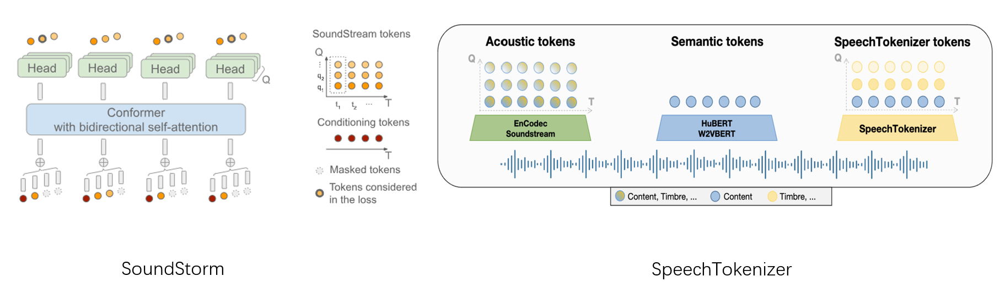

# soundstorm-speechtokenizer
<p style="display: flex; justify-content: center;">
  <figure style="margin-right: 10px;">
    
  </figure>
</p>

## Introduction
Implementation of [SoundStorm](https://arxiv.org/abs/2305.09636) built upon [SpeechTokenizer](https://github.com/ZhangXInFD/SpeechTokenizer). We employ RVQ-1 of SpeechTokenizer as the semantic tokens described in the paper, using it as a condition to generate tokens for the subsequent RVQ layers.


This repository is a modification of [lucidrains/soundstorm-pytorch](https://github.com/lucidrains/soundstorm-pytorch). While the Conformer implementation remains intact from the original, I've rewritten the SoundStorm model and its training components.

## Samples

We used two RTX-3090 gpus to train a toy model on LibriSpeech-960. Samples of zero-shot TTS  on [our demo page](https://0nutation.github.io/SpeechTokenizer.github.io/). Voice conversion samples and unprompt samples are provided in [samples](samples).


### Objective Metrics
#### Zero-shot TTS
| Model| Speaker Similarity|
|:----|:----:|
|VALL-E (our)| 0.7593|
|USLM| 0.8381|
|USLM (SoundStorm)| 0.8827|
#### Voice Conversion
|Model| Speaker Similarity|
|:----|:----:|
|SoundStorm|0.8985|

## Release
- [9/25] 🔥 We released checkpoint trained on LibriSpeech.
### Model storage
| Model| Dataset |Discription|
|:----|:----:|:----|
|[soundstorm_speechtokenizer](https://huggingface.co/fnlp/USLM/tree/main/SoundStorm_LibriSpeech)|LibriSpeech|conformer={'dim':1024,'depth': 12,'heads':8, 'dim_head': 128,'attn_flash': False} |

## Installation

soundstorm-speechtokenizer requires Python>=3.8, and a reasonly recent version of PyTorch.
To install soundstorm_speechtokenizer, you can run from this repository:
```bash
git clone https://github.com/ZhangXInFD/soundstorm-speechtokenizer.git
cd soundstorm-speechtokenizer
pip install .
```

## Usage
```python
import torch, torchaudio
from soundstorm_speechtokenizer import SoundStorm, ConformerWrapper
from speechtokenizer import SpeechTokenizer
from einops import rearrange

conformer = ConformerWrapper(codebook_size=1024,
                            num_quantizers=7,
                            conformer={'dim':1024, 
                                      'depth': 12, 
                                      'heads':8, 
                                      'dim_head': 128, 
                                      'attn_flash': False
                                      },
                                )

soundstorm = SoundStorm(net=conformer,
                        num_semantic_token_ids=1024,
                        semantic_pad_id=1024,
                        pad_id=1024,
                        schedule = 'cosine')

# get your pre-encoded codebook ids from the soundstream from a lot of raw audio

codes = torch.randint(0, 1024, (2, 1024, 7)) # (batch, seq, num RVQ)

# do the below in a loop for a ton of data

loss, acc, generated = soundstorm(codes)
loss.backward()

```
### Train
We provide a trainer to train SoundStorm, which supports both audio input and token sequence input. An example of training is shown in [train.py](train.py). You should generate a text file that record the files used to train and valid before training. An example used to process LibriSpeech-960 is provided in [ls_preprocess.py](ls_preprocess.py).

```python
from soundstorm_speechtokenizer import SoundStormTrainer

# Initial parameters with codebooks of SpeechTokenizer
'''
Parameters initialization can significantly speed up the model's training.
'''
sp_params = '/path/SpeechTokenizer.pt'
sp_params = torch.load(sp_params, map_location='cpu')
soundstorm.semantic_token_emb.weight = torch.nn.Parameter(sp_params['quantizer.vq.layers.0._codebook.embed'])
acoustic_embeds = []
for i in range(1, 8):
    acoustic_embed = torch.cat([sp_params[f'quantizer.vq.layers.{i}._codebook.embed'], torch.zeros(1,1024)], axis=0)
    acoustic_embeds.append(acoustic_embed)
acoustic_embeds = torch.cat(acoustic_embeds, axis=0)
soundstorm.net.code_embeds.weight = torch.nn.Parameter(acoustic_embeds)

# File list used to train and valid 
train_file_list = '/path/train_file_list.txt'
with open(train_file_list, 'r') as f:
    train_file_list = f.readlines()
valid_file_list = '/path/valid_file_list.txt'
with open(valid_file_list, 'r') as f:
    valid_file_list = f.readlines()

result_folder = './Log/result'

# Set input mode
input_mode = 'raw wav'
if input_mode = 'raw wav': # Input raw wav
    is_raw_wav = True
    is_tokens = False
    st_cfg = '/path/config.json'
    st_ckpt = '/path/SpeechTokenizer.pt'  
    tokenizer = SpeechTokenizer.load_from_checkpoint(st_cfg, st_ckpt)
    tokenizer.eval()
else: # Input tokens
    is_raw_wav = False
    is_tokens = True
    tokenizer = None

trainer = SoundStormTrainer(model=soundstorm,
                            num_warmup_steps=4000,
                            batch_size=8,
                            epochs=50,
                            train_file_list=train_file_list,
                            valid_file_list=valid_file_list,
                            is_raw_wav=is_raw_wav,
                            is_tokens=is_tokens,
                            max_sequence=750,
                            tokenizer=tokenizer,
                            lr=6e-4,
                            initial_lr=3e-5,
                            grad_accum_every=2,
                            log_steps=10,
                            save_model_steps=5000,
                            results_folder=result_folder,
                            accelerate_kwargs={
                              'log_with':"tensorboard",
                              'project_dir':f'{result_folder}'
                              },
                            num_workers=8)
trainer.train()

```
### Inference
```python
soundstorm.load('/path/ckpt')                       

st_cfg = '/path/config.json'
st_ckpt = '/path/SpeechTokenizer.pt'  
tokenizer = SpeechTokenizer.load_from_checkpoint(st_cfg, st_ckpt)

# get tokens of prompt
prompt_wav, sr = torchaudio.load('[PROMPT_AUDIO_FILE]')
if sr != tokenizer.sample_rate:
    prompt_wav = torchaudio.functional.resample(wav, sr, tokenizer.sample_rate)
prompt_tokens = rearrange(tokenizer.encode(prompt_wav.unsqueeze(0)), 'q b n -> b n q')

'''
We aslo support unprompt mode, just let:
prompt_token = None
'''
semantic_tokens = [[100, 101, 323, ..., 231]] # (b, n)

steps = 1 # Iteration num to generate the first layer (i.e. RVQ-2)
greedy = True # Whether use greedy search in the last generation
generated = soundstorm.generate(semantic_tokens=semantic_tokens,
                                prompt_tokens=prompt_tokens,
                                steps=steps,
                                greedy=greedy) 

wavs = tokenizer.decode(rearrange(generated, 'n q -> q b n', b=semantic_tokens.size(0))) # wav: (b, 1, t)
```
## Citation
```Tex
@misc{zhang2023speechtokenizer,
      title={SpeechTokenizer: Unified Speech Tokenizer for Speech Language Models}, 
      author={Xin Zhang and Dong Zhang and Shimin Li and Yaqian Zhou and Xipeng Qiu},
      year={2023},
      eprint={2308.16692},
      archivePrefix={arXiv},
      primaryClass={cs.CL}
}
```
## Acknowledgements
We'd like to express our gratitude to the creators of [lucidrains/soundstorm-pytorch](https://github.com/lucidrains/soundstorm-pytorch) for their foundational work which made this project possible.

## License
The code in this repository is released under the MIT license as found in the
[LICENSE](LICENSE) file.